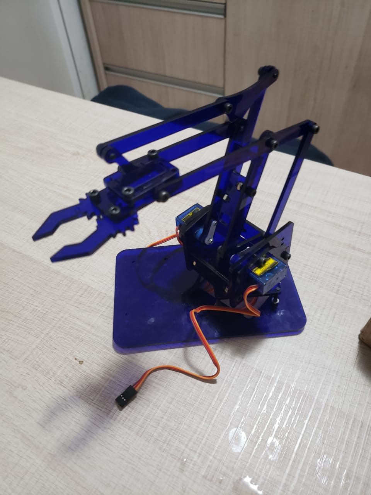
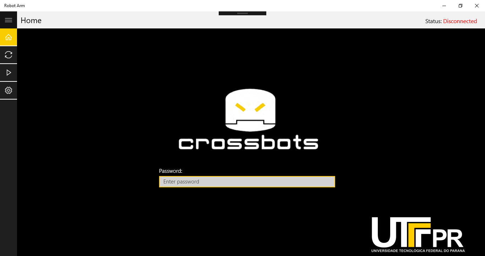
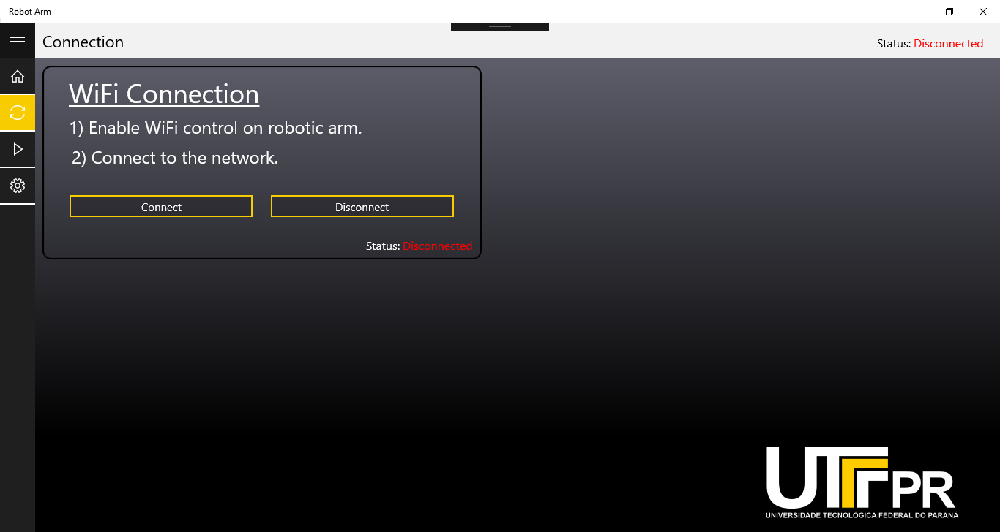
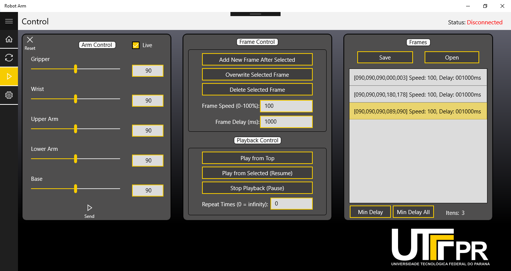

 

  <h3 align="center">Mini Robot Arm</h3>

  

	4 Axis Robot Arm using ESP32 DevKit V1 and controlled by UWP desktop application
     
	 
    <a href="https://github.com/xandao6/mini-robot-arm"><strong>Explore the docs »</strong></a>
     
    <a href="https://github.com/xandao6/mini-robot-arm/issue">Report Bug</a>
    ·
    <a href="https://github.com/xandao6/mini-robot-arm/issues">Request Feature</a>
  

<!-- TABLE OF CONTENTS -->

  
Table of Contents

  <ol>
    <li>
      <a href="#about-the-project">About The Project</a>
      <ul>
        <li><a href="#features">Features</a></li>
        <li><a href="#built-with">Built With</a></li>
      </ul>
    </li>
    <li><a href="#roadmap">Roadmap</a></li>
    <li><a href="#contributing">Contributing</a></li>
    <li><a href="#license">License</a></li>
    <li><a href="#contact">Contact</a></li>
    <li><a href="#acknowledgements">Acknowledgements</a></li>
  </ol>

<!-- ABOUT THE PROJECT -->
## About The Project

  

### Features

* Real time control of the robot arm
* Record and playback movements
* Save and load frames

### Built With

* [ESP32](https://www.espressif.com/en/products/socs/esp32/overview) - ESP32 DevKit V1
* [Arduino](https://www.arduino.cc/) - Arduino Programming Language
* [UWP](https://docs.microsoft.com/en-us/windows/uwp/get-started/universal-application-platform-guide)
* [C#](https://docs.microsoft.com/en-us/dotnet/csharp/) - C# Programming Language

<!-- ROADMAP -->
## Roadmap

See the [open issues](https://github.com/xandao6/mini-robot-arm/issues) for a list of proposed features (and known issues).

<!-- CONTRIBUTING -->
## Contributing

Contributions are what make the open source community such an amazing place to be learn, inspire, and create. Any contributions you make are **greatly appreciated**.

1. Fork the Project
2. Create your Feature Branch (`git checkout -b feature/AmazingFeature`)
3. Commit your Changes (`git commit -m 'Add some AmazingFeature'`)
4. Push to the Branch (`git push origin feature/AmazingFeature`)
5. Open a Pull Request

<!-- LICENSE -->
## License

Distributed under the MIT License. See [LICENSE](./LICENSE.md) for more information.

Free software =)

<!-- CONTACT -->
## Contact

Alexandre Calil - [@xandao6](https://www.linkedin.com/in/xandao6/) - alexandrecalilmf@gmail.com

Project Link: [https://github.com/xandao6/mini-robot-arm](https://github.com/xandao6/mini-robot-arm)
## Acknowledgements

* [eslint](https://github.com/eslint/eslint) - code linter
* [prettier](https://github.com/prettier/prettier) - code formatter
